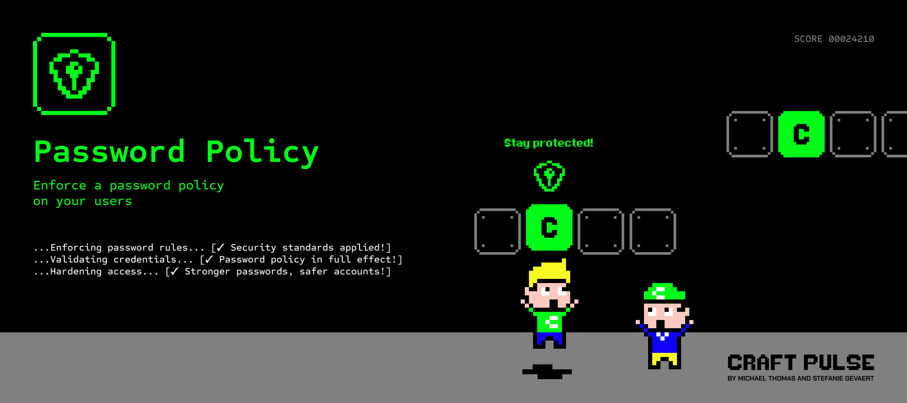

# Password Policy plugin for Craft CMS 5.x

The Password Policy plugin is a powerful tool for enforcing secure password policies within your Craft CMS 5 installation. 
It helps administrators define and manage password rules for users, enhancing security and compliance in multi-user environments.

## Requirements

This plugin requires Craft CMS 5.0.0 or later.

## Installation

To install Password Policy, follow these steps:

1. Open your terminal and go to your Craft project:

        cd /path/to/project

2. Then tell Composer to load the plugin:

        composer require craftpulse/craft-password-policy

3. Install the plugin via `./craft install/plugin password-policy` via the CLI, or in the Control Panel, go to Settings → Plugins and click the “Install” button for Password Policy.

You can also install Password Policy via the **Plugin Store** in the Craft Control Panel.

Password Policy works on Craft 5.x.

## Configuration options

### Minimum Password Length
Define the minimum number of characters a password must contain.
Default: `8`

### Complexity Requirements
The following requirements can be enabled in the plugin settings:

- At least one uppercase and lowercase letter
- At least one number
- At least one special character (e.g., !@#$%)

### Password Strength Indicator
A password strength indicator can be enabled to aid your users into choosing a stronger password

### Have I been pwned?
Enhance your security by ensuring users can not select any leaked password. This employs the k-Anonymity method to validate passwords against the Pwned Passwords API without compromising user privacy by revealing passwords to an external service.

### Password Retention Features
#### Password Expiration Method
You can determine the period in days,weeks,months or years when a password should expire. If you want to make use of this functionality, you can find this under Utilities → Password Retention → Force Reset Passwords.
Or if you want to use this utility through the CLI for e.g. a cronjob you can use `craft password-policy/retention/force-reset-passwords`.

Brought to you by [CraftPulse](https://craftpulse.com/)
